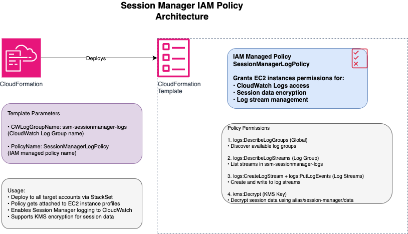
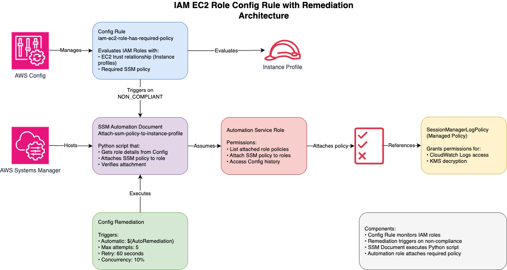
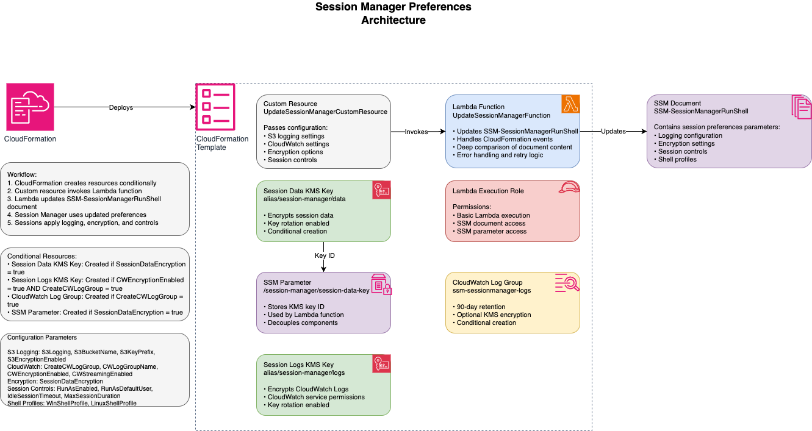

# AWS Systems Manager Session Manager Configuration

## Overview

This repository contains a solution for securing AWS Systems Manager (SSM) Session Manager across multiple AWS accounts. The solution consists of three main components to faciliate deployment of session management:

1. IAM Policy Deployment - Deploys a standardized IAM policy to all target accounts
2. AWS Config Rule with Remediation - Detects and remediates non-compliant instance profiles
3. SSM Session Manager Preferences - Configures Session Manager with security best practices

This solution helps enforce consistent security controls for session management across AWS environment, ensuring proper logging, encryption, and access controls.

> [!NOTE]
> You don't need to deploy the first two components for the solution to work. They help preparing your environment for changing the Session Manager preferences.

## Solution Architecture

The solution follows a three-step implementation process:

1. Step 1 [Optional]: Deploy an IAM policy to all target accounts specified in Landing Zone Accelerator configuration
2. Step 2 [Optional]: Implement an AWS Config rule that detects instance profiles without the required policy and remediates them
3. Step 3: Configure SSM Session Manager preferences with secure defaults for logging, encryption, and session controls

## Component 1: Session Manager IAM Policy

### Template: [session_manager_policy.yaml](templates/session_manager_policy.yaml)

This CloudFormation template creates an IAM managed policy that grants EC2 instances the necessary permissions to send session logs to CloudWatch Logs. This policy is essential for enabling secure logging of all Session Manager activities.

If you decide not to deploy this policy, ensure that your instance profiles have proper permissions to accomodate your session manager preferences changes.

### Resources

#### `AWS::IAM::ManagedPolicy` (SSMPolicy)

This resource creates an IAM managed policy with permissions that allow EC2 instances to:

- Describe CloudWatch Log groups
- Describe CloudWatch Log streams within the specified log group
- Create log streams and put log events in the specified log group
- Decrypt data using the session manager KMS key

The policy includes least-privilege permissions with specific resource-level restrictions to ensure security best practices.

### Parameters

| Parameter      | Description                                            | Default Value           |
| -------------- | ------------------------------------------------------ | ----------------------- |
| CWLogGroupName | The name of the CloudWatch Logs group for session logs | ssm-sessionmanager-logs |
| PolicyName     | The name of the IAM managed policy to be created       | SessionManagerLogPolicy |

The template allows you to customize:

- The CloudWatch Log group name where session logs will be stored
- The name of the IAM policy that will be created and attached to instance profiles

> [!IMPORTANT]
> Policy, and CW log group names specified in the template will be used in other templates.
>
> If you want to use an existing log group to store session logs, pass the name to CWLogGroupName. This value should be consistent across all templates.

### Implementation Notes

This policy must be deployed to all accounts where you want to use Session Manager with logging capabilities. The policy uses resource-level permissions to restrict access to only the specified CloudWatch Log group and KMS key with the alias "alias/session-manager/data". This KMS key is used to encrypt the session data (if enabled through the third component described later in this document).

## Component 2: AWS Config Rule with Remediation

### Template: [iam-ec2-role-has-accelerator-ssm-policy.yaml](templates/iam-ec2-role-has-accelerator-ssm-policy.yaml)

This CloudFormation template creates an AWS Config rule that monitors instance profiles, ensuring they have the Session Manager policy (created by component 1) attached. It also includes an automated remediation action that can attach the required policy to non-compliant roles.

### Resources

#### `AWS::Config::ConfigRule` (IAMRoleProfilePolicyRule)

This resource creates a custom AWS Config rule that evaluates IAM roles to ensure:

- The role has an EC2 trust relationship
- The role is associated with an instance profile
- The role has the specified Session Manager policy attached

The rule uses AWS Config's Guard framework to implement this logic and marks roles as NON_COMPLIANT if they don't meet all criteria.

#### `AWS::SSM::Document` (ConfigRemediationDocument)

This resource creates an SSM Automation document that:

- Takes a non-compliant IAM role as input
- Retrieves the role's configuration from AWS Config
- Attaches the specified Session Manager policy to the role
- Verifies the policy was successfully attached

The document includes error handling and verification steps to ensure remediation is successful.

#### `AWS::IAM::Role` (AutomationServiceRole)

This resource creates an IAM role that allows the SSM Automation document to:

- Assume the role with proper security conditions
- List attached role policies
- Attach the Session Manager policy to IAM roles
- Access AWS Config to retrieve resource configuration history

#### `AWS::IAM::Policy` (AutomationServiceRolePolicy)

This resource creates an inline policy for the automation role with least-privilege permissions to:

- List attached role policies
- Attach the Session Manager policy to roles
- Access AWS Config resource history

#### `AWS::Config::RemediationConfiguration` (ConfigRemediation)

This resource configures the remediation action for the AWS Config rule, specifying:

- The target SSM document to execute
- Whether remediation should be automatic or manual
- Parameters to pass to the remediation document

### Parameters

| Parameter                | Description                             | Default Value           |
| ------------------------ | --------------------------------------- | ----------------------- |
| SessionManagerPolicyName | Name of the policy to check for         | SessionManagerLogPolicy |
| AutoRemediation          | Enable or disable automatic remediation | false                   |

The template allows you to customize:

- The name of the Session Manager policy to check for
- Whether remediation should be automatic or manual

> [!IMPORTANT]
> The value of the `SessionManagerPolicyName` parameter should match the value of `PolicyName` parameter of component 1 template or your custom policy that provides similar permissions.

### Implementation Notes

This component works by continuously monitoring IAM roles across the AWS accounts its deployed into. When it detects a role that has an EC2 trust relationship and an instance profile but doesn't have the required Session Manager
policy, it can either:

- Automatically attach the policy (if `AutoRemediation` is set to true)
- Flag the resource for manual remediation (if `AutoRemediation` is set to false)

The remediation process uses AWS Config's integration with SSM Automation to safely attach the policy to non-compliant roles.

## Component 3: SSM Session Manager Preferences

### Template: [session_manager_preferences.yaml](templates/session_manager_preferences.yaml)

This CloudFormation template configures SSM Session Manager preferences to enforce secure session management practices. It creates resources for logging, encryption, and session controls, and updates the SSM-
SessionManagerRunShell document with these preferences.

### Resources

#### `AWS::Lambda::Function` (UpdateSessionManagerFunction)

This resource creates a Lambda function that:

- Updates the `SSM-SessionManagerRunShell` document with the specified preferences
- Handles CloudFormation create, update, and delete events
- Performs deep comparison of document contents to avoid unnecessary updates
- Includes error handling and retry logic

#### `AWS::IAM::Role` (LambdaExecutionRole)

This resource creates an IAM role that allows the Lambda function to:

- Execute with basic Lambda permissions
- Access and modify the `SSM-SessionManagerRunShell` document
- Access SSM parameters storing session data encryption key ID

#### `AWS::KMS::Key` (SessionDataKMSKey)

This conditional resource creates a KMS key for encrypting session data when SessionDataEncryption parameter is set to enabled. The key has a policy allowing key management with IAM.

#### `AWS::KMS::Alias` (SessionDataKeyAlias)

This conditional resource creates a friendly alias (alias/session-manager/data) for the session data encryption key. This value cannot be changed and is referenced in the policy deployed by component 1.

> [!CAUTION]
> Attempting to change this value can cause sessions fail to initiate.
> Ensure to include this alias in your custom policy if you are not using the policy provided in component 1

#### `AWS::SSM::Parameter` (SessionKeyID)

This conditional resource creates an SSM parameter to store the KMS key ID for session data encryption, making it accessible to other components.

> [!NOTE]
> Session data KMS key ID is stored in a SSM parameter to decouple components and prevent circular dependency.

#### `AWS::KMS::Key` (SessionLogsKMSKey)

This conditional resource creates a KMS key for encrypting CloudWatch Logs when CWEncryptionEnabled parameter is set to enabled. The key has a policy allowing CloudWatch Logs service to use it.

> [!NOTE]
> SessionLogsKMSKey is used to encrypt logs at-rest, and is not used by the SSM agent, so your instance profile does not need to have permissions to this key. Logs are encrypted in-transit and will be encrypted by CloudWatch service once they are received.

#### `AWS::KMS::Alias` (SessionLogsKeyAlias)

This conditional resource creates a friendly alias (alias/session-manager/logs) for the CloudWatch Logs encryption key.

#### `AWS::Logs::LogGroup` (SessionManagerLogGroup)

This conditional resource creates a CloudWatch Logs group for session logs when CreateCWLogGroup paremeter is set to enabled. The log group:

- Uses the specified name (controlled by `CWLogGroupName` parameter, and defaults to `ssm-sessionmanager-logs`)
- Sets a 90-day retention period
- Uses KMS encryption if enabled

> [!IMPORTANT]
> The value of `CWLogGroupName` parameter should match the value of `CWLogGroupName` of component 1. This ensures the SSM agent can verify the existance and configuration of the log group that session logs are being sent to. Session fails to start if these value don't match.

#### `Custom::UpdateSessionManager` (UpdateSessionManagerCustomResource)

This custom resource invokes the Lambda function to update the SSM-SessionManagerRunShell document with all the specified preferences.

### Parameters

The template includes extensive parameters for customizing Session Manager behavior:

| Parameter Group    | Parameters                                                                | Description                         |
| ------------------ | ------------------------------------------------------------------------- | ----------------------------------- |
| S3 Logging         | S3Logging, S3BucketName, S3KeyPrefix, S3EncryptionEnabled                 | Controls logging to S3              |
| CloudWatch Logging | CreateCWLogGroup, CWLogGroupName, CWEncryptionEnabled, CWStreamingEnabled | Controls logging to CloudWatch Logs |
| Encryption         | SessionDataEncryption                                                     | Controls encryption of session data |
| Session Controls   | RunAsEnabled, RunAsDefaultUser, IdleSessionTimeout, MaxSessionDuration    | Controls session behavior           |
| Shell Profiles     | WinShellProfile, LinuxShellProfile                                        | Controls shell environment          |

The template offers extensive customization options for:

- Logging destinations (S3, CloudWatch Logs, or both)
- Encryption settings for logs and session data
- Session timeout and duration controls
- User context for session execution
- Shell profiles for Windows and Linux instances

### Implementation Notes

This component works by updating the default SSM Session Manager preferences document called `SSM-SessionManagerRunShell` that defines the preferences for all Session Manager sessions in the account. The document is updated by a Lambda function that ensures all preferences are correctly applied.

The solution supports multiple logging destinations, encryption options, and session controls to meet various security and compliance requirements.

## Deployment Process

To deploy this solution across your AWS environment:

1. Deploy the Session Manager IAM Policy [Optional]:

   1. Deploy the session_manager_policy.yaml template to all target accounts
   2. This creates the IAM policy that will be attached to instance profiles

2. Deploy the AWS Config Rule with Remediation[Optional]:

   1. Deploy the template to all target accounts
   2. Configure whether remediation should be automatic or manual

3. Configure Session Manager Preferences[Optional]:
   1. Deploy the template to all target accounts
   2. Configure logging, encryption, and session control parameters
